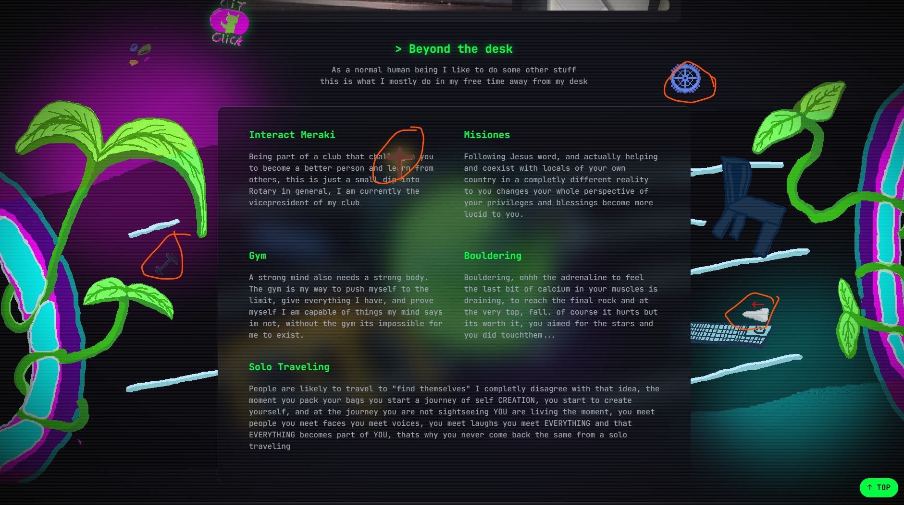

# The Despacho of Cocotrilo

*Dreamer, Maker, a Hobbit in Mordor*

  
  
  

This is my personal website, and also a portfolio, when I was I kid I started playing around with websites, and I created one in WIX hahaha called "EL despacho de cocotrilo" who would have guessed years later it is an actual project.

## Live Demo
[CLICK ME](https://cocotrilito.github.io/the-despacho-of-cocotrilito/)

## Setup
- Clone the repo and open index.html in your browser, ooor, use live server in VS code. have fun and give me feedback <3

## Tech Stack!

- HTML5
- Tailwind CSS (CDN)
- A little bit of JavaScript

## Features

- You are welcomed by a flashing screen like an old tv, then "The despacho of cocotrilo" is typed with an "_" animation, you learn something about the creator, and scroll through his work in a glassmorphism vitrine, with hover effects and a parallax background, and a weird bubblegum git icon, that redirects you to the github page of that specific project, as you continue to scroll the parallax background stops, and the section "beyond the desk starts", You are recieved by a grid an some stickers (try to dragg them) and you get to know more about the creator not just his projects at the end you have a footer with the creators github page, aswell as his youtube and a weird cocodrile or dinosour dancing.

## What I've Learned

- Ok so I learned first about HTML in general, at the start I didnt knew what was h1 or p or even div, with the basic things I started coding uhh but It looked bad indeed, so I started learning more about trends, css and animations, and I just scratched the surface of js, with this new knowleadge I STARTED THE JOURNEY first I began with the colours really simple and then the forms and then the textures and then more backgrounds and more color and then animation, but... it still looked empty. So I wanted to use animations and it was super crazy how its really simple but it makes the page look 10x better, after doing so I started creating my own art, FavIcon footer, stickers bgs but placing them was hell, bugs everywhere, but it was solved, after that I wanted to create something cool I saw in a website ages ago, why not make the stickers draggable?. yes and this was when js was most usefull, I learned a bit of js but the important part is that the process was challenging, also I got helped a lot by claude, oh my boi claude, I have this problem where My divs are closed everywhere and I do not find what they are doing or I get confused its really messy, but he has helped me with a lot of debbuging, at the end of the day I learned to be patient trust the process, and also when I sense something or know that my instict says something, and I make a change or a decision everything looks and works better, but the most important think is to never stop, never throw the towel, the only way to lose is when you decide to lose.

## Screenshots
<table>
    <tr>
        <td><image src="images/readme/Start.png" width="400"></td>
    </tr>
    <tr>
        <td align="center"><b>header</b></td>
        <td align="center"><b>Beyond The Desk</b></td>
    </tr>
    <tr>
        <td></td>
        <td></td>
    </tr>
    <tr>
        <td align="center"><b>Parallax & Hover</b></td>
        <td align="center"><b>Sticker</b></td>
    </tr>
</table>
